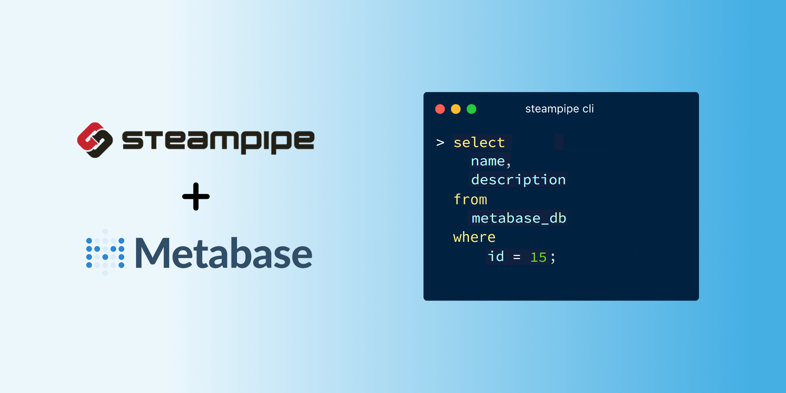

# Metabase Plugin for Steampipe

Use SQL to query models, completions and more from Metabase.

- **[Get started →](https://hub.steampipe.io/plugins/1024pix/metabase)**
- Documentation: [Table definitions & examples](https://hub.steampipe.io/plugins/1024pix/metabase/tables)
- Community: [Join #steampipe on Slack →](https://turbot.com/community/join)
- Get involved: [Issues](https://github.com/1024pix/steampipe-plugin-metabase/issues)

## Quick start

### Install

Download and install the latest Metabase plugin:

```bash
steampipe plugin install 1024pix/metabase
```

Configure your [credentials](https://hub.steampipe.io/plugins/1024pix/metabase#credentials) and [config file](https://hub.steampipe.io/plugins/1024pix/metabase#configuration).

Configure your account details in `~/.steampipe/config/metabase.spc`:

```hcl
connection "metabase" {
  plugin          = "metabase"

  url             = "https://localhost"

  # Authentication information
  user            = "janedoe"
  password        = "my_password"

  tls_skip_verify = true
}
```

Or through environment variables:

```sh
export METABASE_USER="janedoe"
export METABASE_PASSWORD="my_password"
```

Run steampipe:

```shell
steampipe query
```

List database in your Metabase instance:

```sql
SELECT
  id,
  name
FROM
  metabase_db;
```

```
+------+------+
| id   | name |
+------+------+
| 7    | Test |
+------+------+
```

## Developing

Prerequisites:

- [Steampipe](https://steampipe.io/downloads)
- [Golang](https://golang.org/doc/install)

Clone:

```sh
git clone https://github.com/1024pix/steampipe-plugin-metabase.git
cd steampipe-plugin-metabase
```

Build, which automatically installs the new version to your `~/.steampipe/plugins` directory:

```
make
```

Configure the plugin:

```
cp config/* ~/.steampipe/config
vi ~/.steampipe/config/metabase.spc
```

Try it!

```
steampipe query
> .inspect metabase
```

Further reading:

- [Writing plugins](https://steampipe.io/docs/develop/writing-plugins)
- [Writing your first table](https://steampipe.io/docs/develop/writing-your-first-table)

## Contributing

Please see the [contribution guidelines](https://github.com/turbot/steampipe/blob/main/CONTRIBUTING.md) and our [code of conduct](https://github.com/turbot/steampipe/blob/main/CODE_OF_CONDUCT.md). All contributions are subject to the [Apache 2.0 open source license](https://github.com/1024pix/steampipe-plugin-metabase/blob/main/LICENSE).

`help wanted` issues:

- [Steampipe](https://github.com/turbot/steampipe/labels/help%20wanted)
- [Metabase Plugin](https://github.com/1024pix/steampipe-plugin-metabase/labels/help%20wanted)
